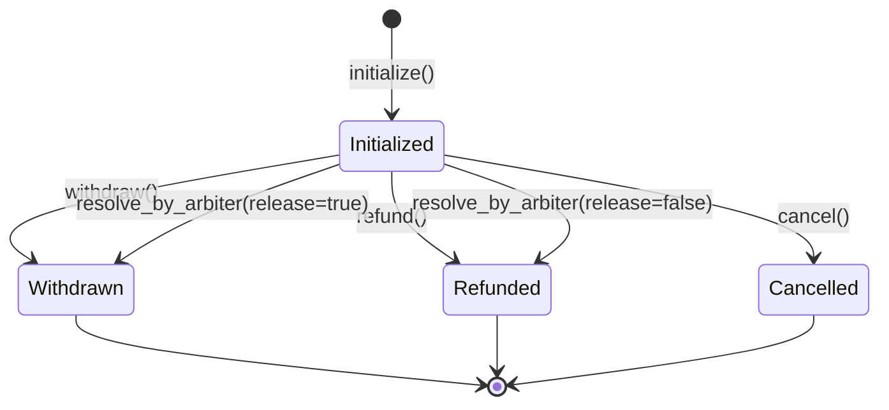

# Advanced Solana Escrow Program

This is a professional-grade SPL token escrow program built on Solana using the Anchor framework. It is designed to be a secure and flexible solution for trustless transactions, enhanced with features for arbitration and better state management.

This project serves as a demonstration of advanced Solana smart contract development practices.

## Features

- **SPL Token Escrow**: Securely hold SPL tokens in a Program-Derived Address (PDA) vault.
- **State Machine**: The escrow has a clear, on-chain status (`Initialized`, `Withdrawn`, `Refunded`, `Cancelled`) to track its lifecycle.
- **Timeout**: A configurable timeout allows the initializer to reclaim their funds if the recipient does not act.
- **Cancellable**: The initializer can cancel the escrow and retrieve their funds at any point before the timeout expires.
- **Arbitration**: A designated trusted third-party (the arbiter) can resolve disputes by releasing the funds to either the initializer or the recipient.
- **Event-Driven**: All state transitions emit events, making it easy for off-chain clients to monitor and react to escrow activity.

## Business Flow

The escrow process follows a clear lifecycle, managed by the on-chain state.

### Roles

*   **Initializer**: The party who creates the escrow and deposits the funds.
*   **Recipient**: The party who is intended to receive the funds.
*   **Arbiter**: A neutral third party who can resolve disputes between the initializer and the recipient.

### State Diagram

Here is a diagram representing the flow of the escrow states:



### Explanation of the Flow

1.  **Initialization**: The `Initializer` creates the escrow by calling the `initialize` instruction. They specify the `Recipient`, the `Arbiter`, the token `amount`, and a `timeout`. The tokens are transferred from the initializer's account into a secure vault controlled by the program. The escrow state is set to `Initialized`.
2.  **Withdrawal**: If the conditions are met, the `Recipient` can call the `withdraw` instruction before the timeout expires. The tokens are transferred from the vault to the recipient's account, and the escrow state is set to `Withdrawn`.
3.  **Refund**: If the timeout expires and the recipient has not withdrawn the funds, the `Initializer` can call the `refund` instruction to retrieve their tokens. The escrow state is set to `Refunded`.
4.  **Cancellation**: At any point before the timeout expires, the `Initializer` can call the `cancel` instruction to cancel the escrow and get their funds back. The escrow state is set to `Cancelled`.
5.  **Arbitration**: If there is a dispute, the `Arbiter` can intervene by calling `resolve_by_arbiter`. They can choose to release the funds to the `Recipient` (moving the state to `Withdrawn`) or return them to the `Initializer` (moving the state to `Refunded`).

## How to Use

### Prerequisites

*   Rust
*   Solana CLI
*   Anchor Framework (`avm install latest`)

### Build

To build the program, run:

```bash
anchor build
```

### Test

To run the tests, you first need to start a local validator.

```bash
solana-test-validator &
```

Then, run the tests:

```bash
anchor test --skip-local-validator
```

*(Note: The standard `anchor test` command may have issues with its built-in validator in some environments. The method above is more reliable.)*
